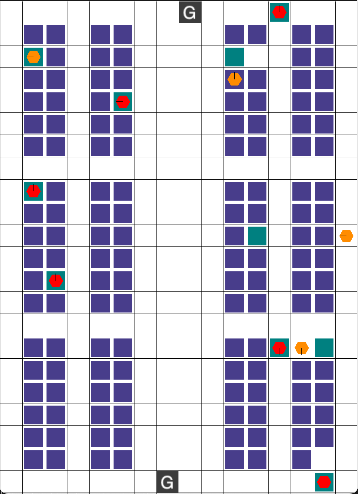

# User Guide To Dynamic Space Time A* and Cooperative A*

## Table of Content

- [User Guide To Dynamic Space Time A\* and Cooperative A\*](#user-guide-to-dynamic-space-time-a-and-cooperative-a)
  - [Table of Content](#table-of-content)
  - [Introduction](#introduction)
  - [Setup](#setup)
  - [Configuration](#configuration)
    - [Naming Scheme and Customisation of Warehouse Layout](#naming-scheme-and-customisation-of-warehouse-layout)
    - [Customisation of Warehouse Properties](#customisation-of-warehouse-properties)
  - [Example Output](#example-output)

## Introduction

This project implements a multi-agent warehouse system that leverages a Dynamic Space-Time A* incorporated with a Priority-Aware Cost-Based Task Assignment for real-time path planning in dynamic environments. The system is designed to efficiently handle both standard and high-priority delivery tasks by dynamically adjusting agent paths during execution and prioritising urgent tasks during assignment. This README provides setup instructions and configuration details.

## Setup

After downloading the zip file provided, there will be three files and one folder:

* Space Time A* - Contains the full code for running Dynamic Space Time A*
* Cooperative A* - Contains the full code for running Cooperative A*
* Layout - Contains the various warehouse layout used for testing
* rware folder

The rware folder contains a customised environment that introduces task priority to the request queue. The original RWARE can be found at [robotic-warehouse](https://github.com/semitable/robotic-warehouse).

## Configuration

All configurations to the environment only occur in the main loop function for both algorithms.

### Naming Scheme and Customisation of Warehouse Layout

The customised rware library contains several default environments that are also found in the original rware library. The registered names look like `rware-tiny-2ag-v1`. Every name always starts with rware. The map size is represented as -tiny, -small, -medium, or -large. The number of robots in the map is selected as `Xag` with X being a number larger than one (e.g. -10ag for 10 agents). A difficulty modifier is optionally appended in the form of -easy or -hard, making requested shelves twice or half the number of agents. Finally -v2 is the version. An few examples would be:

```
env = gym.make("rware-small-2ag-v2")
env = gym.make("rware-medium-10ag-v2")
env = gym.make("rware-large-20ag-hard-v2")
```

For custom layouts, you can follow the format as shown in the `Layout.txt` file. An example would be:

```

layout1_medium = """
........g.......
.XX.XX....XX.XX.
.XX.XX....XX.XX.
.XX.XX....XX.XX.
.XX.XX....XX.XX.
.XX.XX....XX.XX.
.XX.XX....XX.XX.
................
.XX.XX....XX.XX.
.XX.XX....XX.XX.
.XX.XX....XX.XX.
.XX.XX....XX.XX.
.XX.XX....XX.XX.
.XX.XX....XX.XX.
................
.XX.XX....XX.XX.
.XX.XX....XX.XX.
.XX.XX....XX.XX.
.XX.XX....XX.XX.
.XX.XX....XX.XX.
.XX.XX....XX.XX.
.......g........
"""

# General Use Case
env = gym.make("rware-large-20ag-hard-v2", layout = layout1_medium)

# Use Case for the Provided Files
main_loop_with_priority(layout1_medium)
```

This will transform `X`s into shelves and `g`s into goals to the results below. Note that at least one goal must be placed in any layout.

<div style="text-align: center;">
  
</div>

The agents will then be random placed in the warehouse. For testing purposes, you may set a specific seed like so:

```
obs, info = env.reset(seed = 42)
```

### Customisation of Warehouse Properties

Besides the original features that the original RWARE introduces such as `request_queue_size` and `n_agents` which specifies the number of requested shelves that need to be delivered and the number of agents respectively, the custom environment allows the user to also specify the number of tasks that are being requested to be high priority and their priority level. An example is shown below:

```
env = gym.make("rware-medium-2ag-easy-v2", request_queue_size=20, n_agents=20, 
                num_high_priority=10, priority_level=55, layout = layout)
```

`num_high_priority` tells the environment of the 20 requested shelves, 10 of them will be high priority while `priority_level` indicates the number of timesteps before the high priority task is considered late.

## Example Output

Below is the example output of the algorithms. 

The Runtime Performance section shows the total simulation time and how it was distributed among task assignment, path planning, and execution.

The Task Delivery Performance section evaluates how effectively tasks were completed, reporting the total number of tasks and high-priority tasks delivered, the throughput rates, punctuality rates, and any delays. It also records the total makespan, overall travel distance by all agents, and the average distance travelled per agent.

```
============ Runtime Performance Summary ============
Total runtime: 10.30 seconds
Task assignment time: 0.14 seconds (1.3%)
Path planning time: 3.37 seconds (32.7%)
Execution time: 0.66 seconds (6.4%)

============ Task Delivery Performance ============
Total Tasks Completed: 10
Overall Throughput: 0.116 tasks/time unit
Total High-priority Tasks Completed: 2
High-priority Task Throughput: 0.023 tasks/time unit
Tasks Delivered on Time: 2 (100.0%)
Tasks Delivered Late: 0
Total Makespan: 86
Total Travel Distance: 541
Average Travel Distance per Agent: 54.10
===================================================
```
